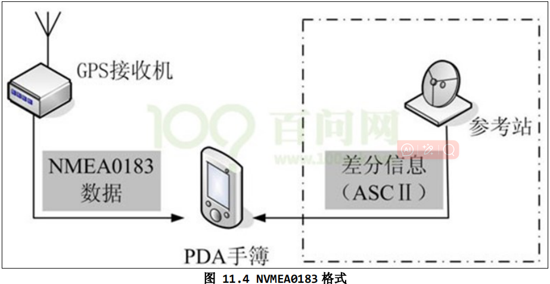

<!--
 * @Author: Clark
 * @Email: haixuanwoTxh@gmail.com
 * @Date: 2024-09-08 15:38:02
 * @LastEditors: Clark
 * @LastEditTime: 2024-09-08 16:34:16
 * @Description: file content
-->

https://digilander.libero.it/robang/rubrica/serial.htm

fd = open( "/dev/ttyS0", O_RDWR|O_NOCTTY|O_NDELAY);

如果不是开发终端之类的，只是串口传输数据，而不需要串口来处理，那么使用原始模式(Raw Mode)方式来通讯，设置方式如下：
options.c_lflag  &= ~(ICANON | ECHO | ECHOE | ISIG);  /*Input*/
options.c_oflag  &= ~OPOST;   /*Output*/

struct termios
{
  unsigned short c_iflag;   /* 输入模式标志 */
  unsigned short c_oflag;   /* 输出模式标志 */
  unsigned short c_cflag;   /* 控制模式标志 */
  unsigned short c_lflag;   /* 区域模式标志或本地模式标志或局部模式 */
  unsigned char c_line;     /* 行控制line discipline */
  unsigned char c_cc[NCC];  /* 控制字符特性 */
};

# uart 读写测试
cd 01_app_send_recv
arm-buildroot-linux-gnueabihf-gcc -o serial_send_recv serial_send_recv.c

在开发板上执行
./serial_send_recv /dev/ttymxc5

# GPS
全球定位系统(Global Positioning System，GPS)

串口进行通讯，波特率为 9600bps,1bit 停止位，无校验位，无流控，默认每秒输出一次标准格式数据

集成模块：模组
GNSS 格式是 NMEA0183 格式
逗点隔开数据流，数据流长度从 30-100 字符不等，通常以每秒间隔持续输出。

NVMEA0183 格式主要针对民用定位导航，与专业 RTCM2.3/3.0 和 CMR+的GNSS 数据格式不同

通过 NMEA0183 格式，可以实现 GNSS 接收机与 PC 或 PDA之间的数据交换，可以通过 USB 和 COM 口等通用数据接口进行数据传输

收到的数据包含：
- $GPGGA（GPS定位数据）
- $GPGLL（地理定位信息）
- $GPGSA（当前卫星信息）
- $GPGSV（可见卫星状态信息）
- $GPRMC（推荐最小定位信息）
- $GPVTG（地面速度信息）

$GPGGA (Global Positioning System Fix Data)即可，它包含了
- GPS定位经纬度
- 质量因子
- HDOP
- 高程
- 参考站号等字段

cd 02_gps
arm-buildroot-linux-gnueabihf-gcc -o gps_read gps_read.c

在开发板上运行
./gps_read /dev/ttymxc5

