<!--
 * @Author: Clark
 * @Email: haixuanwoTxh@gmail.com
 * @Date: 2024-09-08 11:38:09
 * @LastEditors: Clark
 * @LastEditTime: 2024-09-08 16:19:58
 * @Description: file content
-->

# 参考资料：I2Ctools

https://mirrors.edge.kernel.org/pub/software/utils/i2c-tools/

I2C（Inter-Integrated Circuit，总线）是一种串行接口，用于连接嵌入式系统中的设备。其中，用于传输数据的两条信号线有特定的名称：

SCL：（Synchronization Clock）同步时钟线，也称为SCL线或时钟线。它是一个双向线，用于同步数据传输的开始和结束。驱动器在每个I2C周期的开始和结束时拉高此线，以便接收器能够检测周期的边界。

SDA：（Serial Data）串行数据线，也称为SDA线或数据线。这是一条双向线，用于在I2C总线上传输字节。当设备需要发送数据时，SCL稳定低时，SDA线的状态会由驱动器设置；当设备接收数据时，SCL拉高时，SDA线的状态由接收器读取。

在I2C通信中，设备通过检测SCL线的状态来确定何时发送或接收数据，SDA线则是数据传输的实际通道。

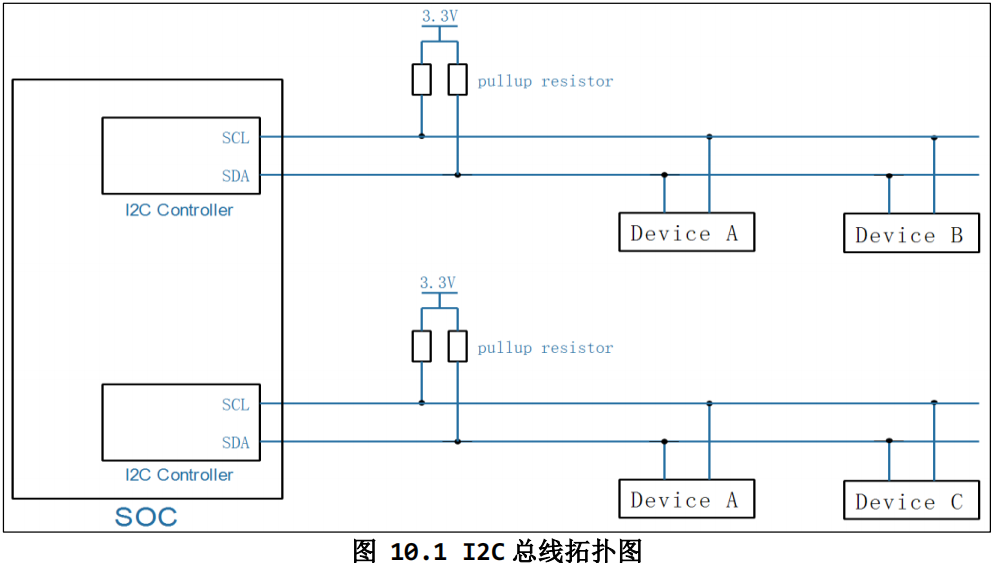

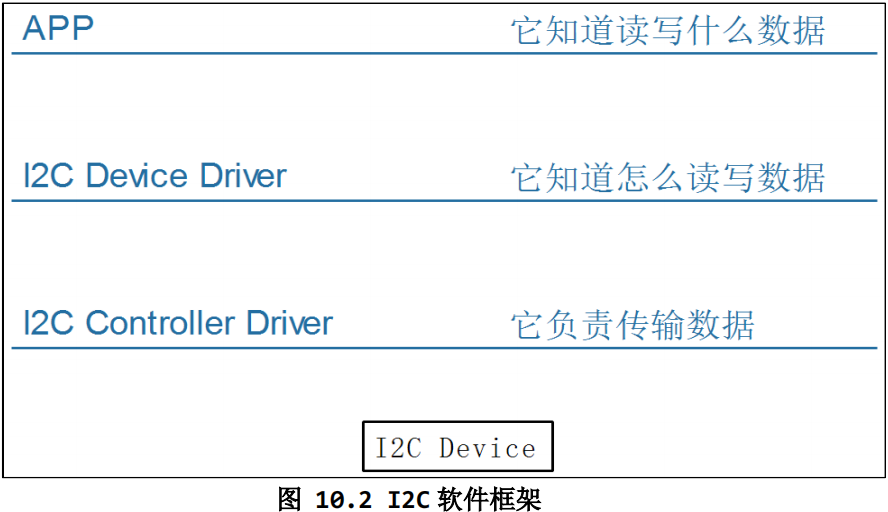

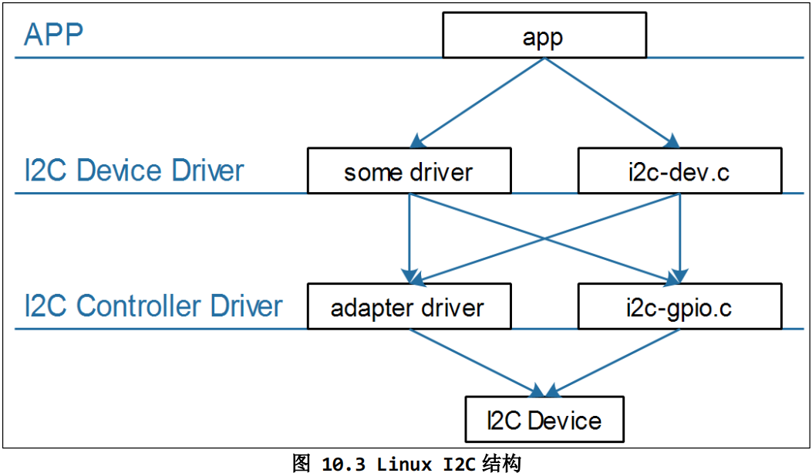

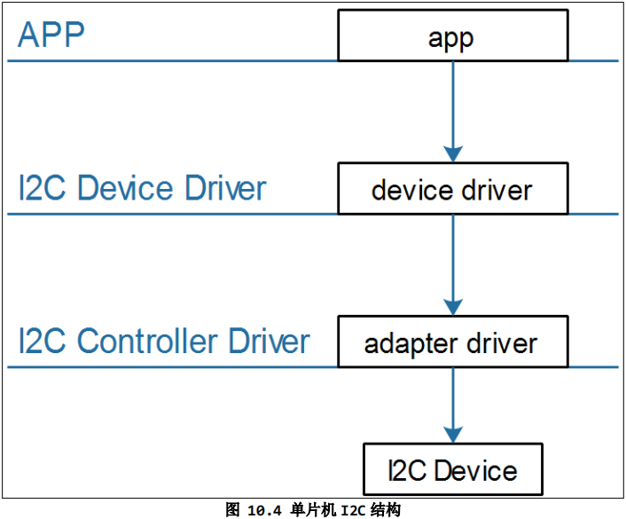

- 在一个芯片(SoC)内部，有一个或多个 I2C 控制器
- 在一个 I2C 控制器上，可以连接一个或多个 I2C 设备
- I2C 总线只需要 2 条线：时钟线 SCL、数据线 SDA
- 在 I2C 总线的 SCL、SDA 线上，都有上拉电阻

## I2C 控制器驱动
- 它根据 I2C 协议发出各类信号：I2C 设备地址、I2C 存储地址、数据
- 它根据 I2C 协议判断

APP 可以通过两类驱动程序访问设备
- I2C 设备自己的驱动程序
- 内核自带的 i2c-dev.c 驱动程序，它是 i2c 控制器驱动程序暴露给用户空间的驱动程序(i2c-dev.c)

## I2C Device Driver
- I2C 设备自己的驱动程序
- 内核自带的 i2c-dev.c 驱动程序，它是 i2c 控制器驱动程序暴露给用户空间的驱动程序(i2c-dev.c)

## I2C Controller Driver
- 芯片I2C控制器的驱动程序(称为adapter)
- 使用GPIO模拟的I2C控制器驱动程序(i2c-gpio.c)

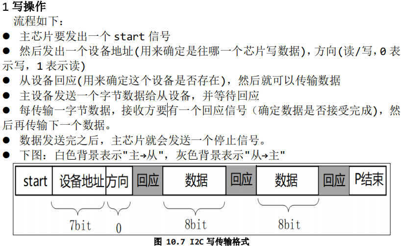

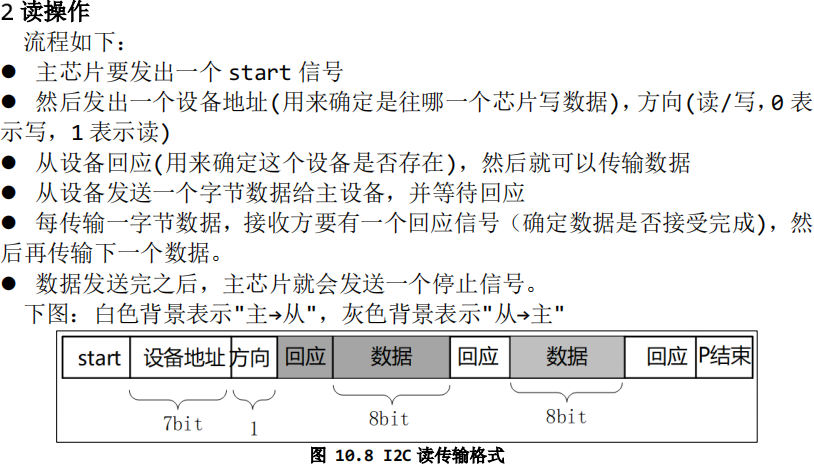

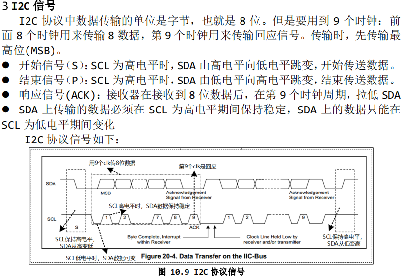

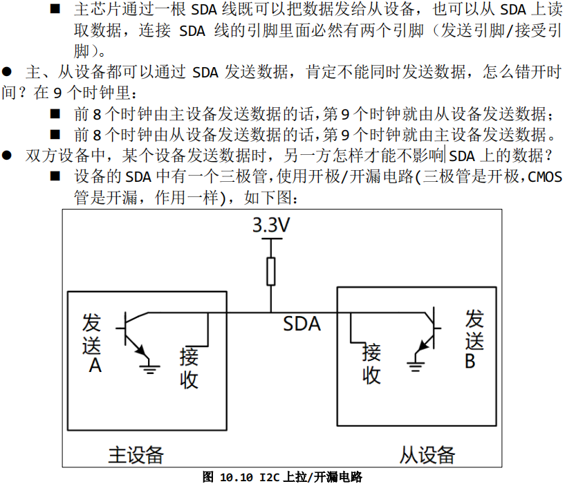

# SMBus协议
SMBus是基于I2C协议的，SMBus要求更严格，SMBus是I2C协议的子集

i2c_adapter：芯片I2C控制器的驱动程序
i2c_algorithm
i2c_client 来表示一个I2C Device
i2c_msg ：传输的数据
i2c_transfer

# 2C-Tools-4.2

tar -Jxf i2c-tools-4.2.tar.xz
cd i2c-tools-4.2/
vim Makefile

CC = $(CROSS_COMPILE)gcc
AR = $(CROSS_COMPILE)ar
STRIP = $(CROSS_COMPILE)strip

make USE_STATIC_LIB=1

i2cdetect i2cdump i2cset i2cget i2ctransfer

## i2cdetect

- 列出当前的I2C Adapter(或称为I2C Bus、I2C Controller)
i2cdetect -l

- 打印某个I2C Adapter的Functionalities, I2CBUS为0、1、2等整数
i2cdetect -F I2CBUS
i2cdetect -F 0

- 看看有哪些I2C从设备, I2CBUS 为 0、1、2 等整数
i2cdetect -y -a I2CBUS

## i2cget
// 读一个字节: I2CBUS 为 0、1、2 等整数,表示 I2C Bus; CHIP-ADDRESS表示设备地址
i2cget -f -y I2CBUS CHIP-ADDRESS

// 读某个地址上的一个字节:
// I2CBUS为0、1、2等整数, 表示 I2C Bus
// CHIP-ADDRESS 表示设备地址
// DATA-ADDRESS: 芯片上寄存器地址
// MODE：有 2 个取值, b-使用`SMBus Read Byte`先发出 DATA-ADDRESS, 再读一个字节, 中间无P信号
// c-先 write byte, 在 read byte，中间有 P 信号
i2cget -f -y I2CBUS CHIP-ADDRESS DATA-ADDRESS MODE

// 读某个地址上的 2 个字节:
// I2CBUS 为 0、1、2 等整数, 表示 I2C Bus
// CHIP-ADDRESS 表示设备地址
// DATA-ADDRESS: 芯片上寄存器地址
// MODE：w-表示先发出 DATA-ADDRESS，再读 2 个字节
i2cget -f -y I2CBUS CHIP-ADDRESS DATA-ADDRESS MODE

## i2cset
// 写一个字节: I2CBUS 为 0、1、2 等整数, 表示 I2C Bus; CHIP-ADDRESS 表示设备地址
// DATA-ADDRESS 就是要写的数据
i2cset -f -y I2CBUS CHIP-ADDRESS DATA-ADDRESS

// 给 address 写 1 个字节(address, value):
// I2CBUS 为 0、1、2 等整数, 表示 I2C Bus; CHIP-ADDRESS 表示设备地址
// DATA-ADDRESS: 8 位芯片寄存器地址;
// VALUE: 8 位数值
// MODE: 可以省略，也可以写为 b
i2cset -f -y I2CBUS CHIP-ADDRESS DATA-ADDRESS VALUE [b]

// 给 address 写 2 个字节(address, value):
// I2CBUS 为 0、1、2 等整数, 表示 I2C Bus; CHIP-ADDRESS 表示设备地址
// DATA-ADDRESS: 8 位芯片寄存器地址;
// VALUE: 16 位数值
// MODE: w
i2cset -f -y I2CBUS CHIP-ADDRESS DATA-ADDRESS VALUE w

// SMBus Block Write：给 address 写 N 个字节的数据
// 发送的数据有：address, N, value1, value2, ..., valueN
// 跟`I2C Block Write`相比, 需要发送长度 N
// I2CBUS 为 0、1、2 等整数, 表示 I2C Bus; CHIP-ADDRESS 表示设备地址
// DATA-ADDRESS: 8 位芯片寄存器地址;
// VALUE1~N: N 个 8 位数值
// MODE: s
i2cset -f -y I2CBUS CHIP-ADDRESS DATA-ADDRESS VALUE1 ... VALUEN s

// I2C Block Write：给 address 写 N 个字节的数据
// 发送的数据有：address, value1, value2, ..., valueN
// 跟`SMBus Block Write`相比, 不需要发送长度 N
// I2CBUS 为 0、1、2 等整数, 表示 I2C Bus; CHIP-ADDRESS 表示设备地址
// DATA-ADDRESS: 8 位芯片寄存器地址;
// VALUE1~N: N 个 8 位数值
// MODE: i
i2cset -f -y I2CBUS CHIP-ADDRESS DATA-ADDRESS VALUE1 ... VALUEN i

## i2ctransfer：I2C 传输(不是基于 SMBus)

// Example (bus 0, read 8 byte at offset 0x64 from EEPROM at 0x50):
- i2ctransfer -f -y 0 w1@0x50 0x64 r8
// Example (bus 0, write 3 byte at offset 0x64 from EEPROM at 0x50):
- i2ctransfer -f -y 0 w9@0x50 0x64 val1 val2 val3
// Example
// first: (bus 0, write 3 byte at offset 0x64 from EEPROM at 0x50)
// and then: (bus 0, read 3 byte at offset 0x64 from EEPROM at 0x50)
- i2ctransfer -f -y 0 w9@0x50 0x64 val1 val2 val3 r3@0x50
- i2ctransfer -f -y 0 w9@0x50 0x64 val1 val2 val3 r3 //如果设备地址不变,后面的设备地址可省略

## 光感芯片AP3216C

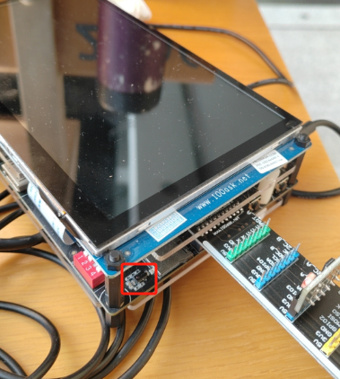

- 使用SMBus协议
i2cset -f -y 0 0x1e 0 0x4
i2cset -f -y 0 0x1e 0 0x3
i2cget -f -y 0 0x1e 0xc w
i2cget -f -y 0 0x1e 0xe w

- 使用I2C协议
i2ctransfer -f -y 0 w2@0x1e 0 0x4
i2ctransfer -f -y 0 w2@0x1e 0 0x3
i2ctransfer -f -y 0 w1@0x1e 0xc r2
i2ctransfer -f -y 0 w1@0x1e 0xe r2

# AT24C02

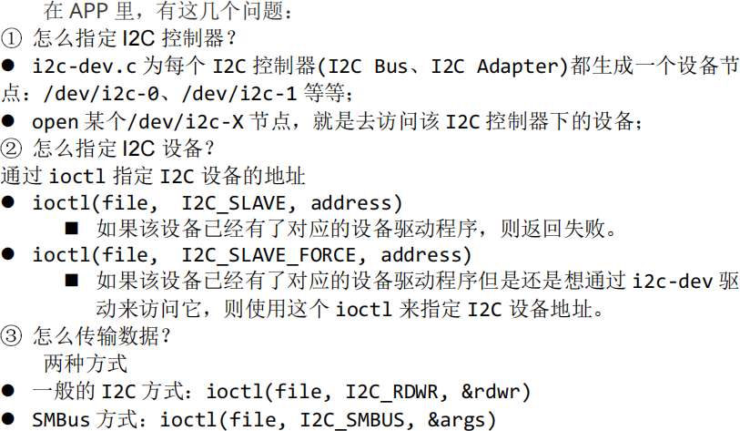

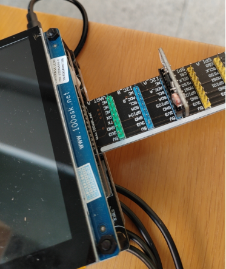

cd 01_at24c02_test
make

在开发板上运行imx6ull上运行：
./at24c02_test 0 w www.100ask.net
./at24c02_test 0 r

