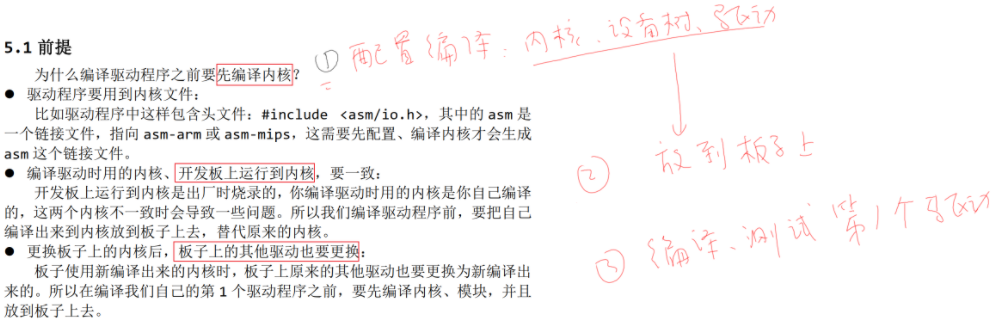
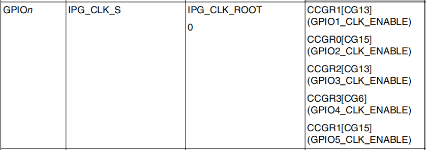
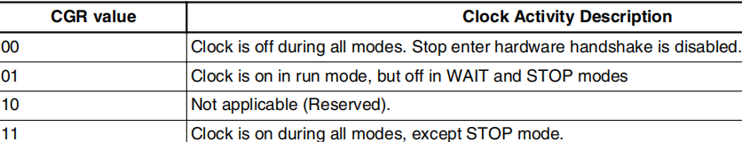
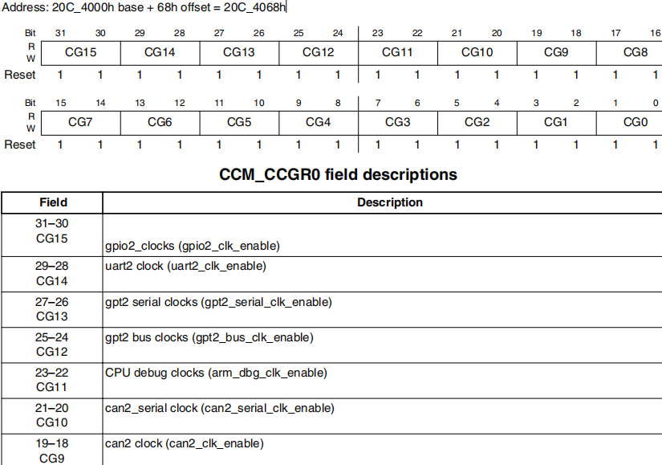
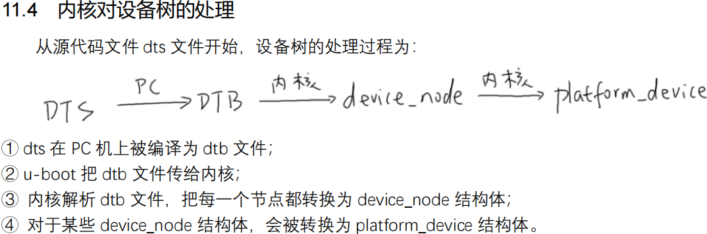

<!--
 * @Author: Clark
 * @Email: haixuanwoTxh@gmail.com
 * @Date: 2024-09-15 10:47:24
 * @LastEditors: Clark
 * @LastEditTime: 2024-09-16 21:57:44
 * @Description: file content
-->

# Driver Basic

## 1、嵌入式Linux驱动的框架

## 2、怎么编写驱动程序？
- 确定主设备号，也可以让内核分配
- 定义自己的 file_operations 结构体
- 实现对应的 drv_open/drv_read/drv_write 等函数，填入 file_operations 结构体
- 把 file_operations 结构体告诉内核：register_chrdev
- 谁来注册驱动程序啊？得有一个入口函数：安装驱动程序时，就会去调用这个入口函数
- 有入口函数就应该有出口函数：卸载驱动程序时，出口函数调用 unregister_chrdev
- 其他完善：提供设备信息，自动创建设备节点：class_create, device_create

## 3、怎样去点亮一个LED

- 1、看原理图确定引脚，确定引脚输出什么电平才能点亮/熄灭 LED
- 2、看主芯片手册，确定寄存器操作方法：哪些寄存器？哪些位？地址是？
- 3、编写驱动：先写框架，再写硬件操作的代码

## 4、GPIO寄存器操作
1、使能开关。有些芯片默认使能，但可能增加功耗
2、复用功能设置。GPIO 引脚可以复用为其他功能，如 SPI、I2C、UART、PWM、ADC、DAC 等
3、GPIO 方向设置。输入、输出、上拉下拉
4、GPIO 状态读取。读取 GPIO 引脚的电平状态
5、GPIO 状态设置。设置 GPIO 引脚的电平状态
6、中断设置。使能 GPIO 引脚的中断功能
7、中断状态读取。读取 GPIO 引phyr 的中断状态
8、防抖动、隔离。防止短时间的高电平或低电平跳变，增加隔离性

映射物理地址到虚拟地址
virt_addr = ioremap(phys_addr, size);
volatile，告诉它“这是容易出错的，别乱优化

## 5、代码1
register_chrdev
class_create
device_create

device_destroy
class_destroy
unregister_chrdev

## 6、代码2

alloc_chrdev_region
cdev_init
cdev_add
class_create
device_create

device_destroy
class_destroy
cdev_del
unregister_chrdev_region

### chapter 18：时钟控制寄存器

### chapter 32:IOMUX Controller

### chapter 28: direction register

## 驱动编写三种方式

- 1、传统
直接编写驱动程序，调用系统函数，如open、read、write、ioctl等

- 2、总线设备驱动模型
 platform_device/platform_driver
 使用开源驱动程序，如Linux内核中提供的驱动程序，如 SCSI、USB、GPIO 等

“分离”：Bus/Dev/Drv 模型

- 3、设备树
修改引脚时只需要修改dts文件并编译得到dtb文件，把它传给内核。
无需重新编译内核/驱动

核心永远是file_operations结构体。
上述三种方法，只是指定“硬件资源”的方式不一样。

## 设备数

板子：ls /sys/firmware/
内核源码：Linux-4.9.88/arch/arm/boot/dts/100ask_imx6ull-14x14.dts

### 常用属性
- 1、#address-cells、#size-cells

cell 指一个 32 位的数值，
address-cells：address 要用多少个 32 位数来表示；
size-cells：size 要用多少个 32 位数来表示。

- 2、compatible
“compatible”表示“兼容”，对于某个 LED，内核中可能有 A、B、C 三个驱动都支持它

- 3、model
model 属性与 compatible 属性有些类似，但是有差别。
compatible 属性是一个字符串列表，表示可以你的硬件兼容 A、B、C 等驱动；
model 用来准确地定义这个硬件是什么。

- 4、status
    dtsi 文件中定义了很多设备，但是在你的板子上某些设备是没有的。这时你可以给这个
    设备节点添加一个 status 属性，设置为“disabled”：

- 5、reg
reg 的本意是 register，用来表示寄存器地址。
但是在设备树里，它可以用来描述一段空间。反正对于 ARM 系统，寄存器和内存是统
一编址的，即访问寄存器时用某块地址，访问内存时用某块地址，在访问方法上没有区别。

- 6、name(过时了，建议不用)
- 7、device_type(过时了，建议不用)

### 常用的节点(node)

- 根节点
- CPU 节点
- memory 节点
- chosen 节点

将dts编译成dtb文件：
在kernel源码目录下执行：
- make dtbs V=1

内核目录下 scripts/dtc/dtc 是设备树的编译工具
/sys/firmware/fdt

./scripts/dtc/dtc -I dts -O dtb -o tmp.dtb arch/arm/boot/dts/xxx.dts // 编译 dts 为 dtb
./scripts/dtc/dtc -I dtb -O dts -o tmp.dts arch/arm/boot/dts/xxx.dtb // 反编译 dtb 为 dts

/scripts/dtc/dtc -I dtb -O dts /从板子上/复制出来的/fdt -o tmp.dts

scripts/dtc/dtc -I dtb -O dts -o tmp.dts arch/arm/boot/dts/xxx.dtb

更换设备树
make dtbs

内核源码目录：
Linux-4.9.88/arch/arm/boot/dts/100ask_imx6ull-14x14.dts

板子目录：
/boot/100ask_imx6ull-14x14.dtb

## 编译设备树驱动
cd 06_led_drv_template_device_tree_100ask
make

板子：
insmod leddrv.ko
insmod chip_demo_gpio.ko
ledtest

以下目录对应设备树的根节点，可以从此进去找到自己定义的节点
/sys/firmware/devicetree/base/

以下目录含有注册进内核的所有 platform_device
/sys/devices/platform

## 按键key
APP去读按键的方法有 4 种：
- 查询方式
- 休眠-唤醒方式
- poll 方式
- 异步通知方式

驱动的基本技能：
- 中断
- 休眠
- 唤醒
- poll等机制

APP开发的基本技能：
- 阻塞
- 非阻塞
- 休眠
- poll
- 异步通知。

GPIO5_1
GPIO4_IO14

## 中断

CPU 在运行的过程中，也会被各种“异常”打断。这些“异常”有：
① 指令未定义
② 指令、数据访问有问题
③ SWI(软中断)
④ 快中断
⑤ 中断
中断也属于一种“异常”，导致中断发生的情况有很多，比如：
① 按键
② 定时器
③ ADC 转换完成
④ UART 发送完数据、收到数据
⑤ 等等
这些众多的“中断源”，汇集到“中断控制器”，由“中断控制器”选择优先级最高的中断并通
知 CPU。

## arm 对异常(中断)处理过程：
① 初始化：
a. 设置中断源，让它可以产生中断
b. 设置中断控制器(可以屏蔽某个中断，优先级)
c. 设置 CPU 总开关(使能中断)
② 执行其他程序：正常程序
③ 产生中断：比如按下按键--->中断控制器--->CPU
④ CPU 每执行完一条指令都会检查有无中断/异常产生
⑤ CPU 发现有中断/异常产生，开始处理。
对于不同的异常，跳去不同的地址执行程序。
这地址上，只是一条跳转指令，跳去执行某个函数(地址)，这个就是异常向量。
③④⑤都是硬件做的。
⑥ 这些函数做什么事情？
软件做的:
a. 保存现场(各种寄存器)
b. 处理异常(中断):
分辨中断源，再调用不同的处理函数
c. 恢复现场