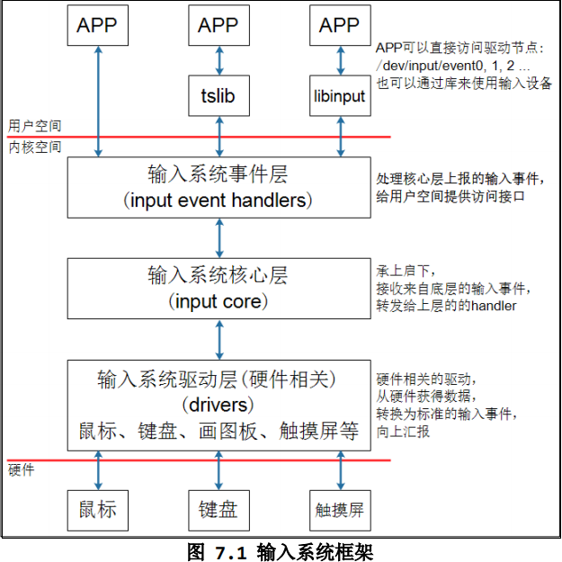
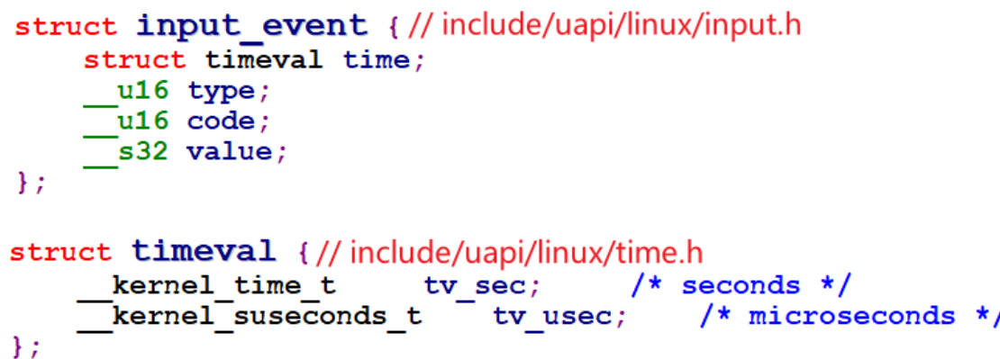
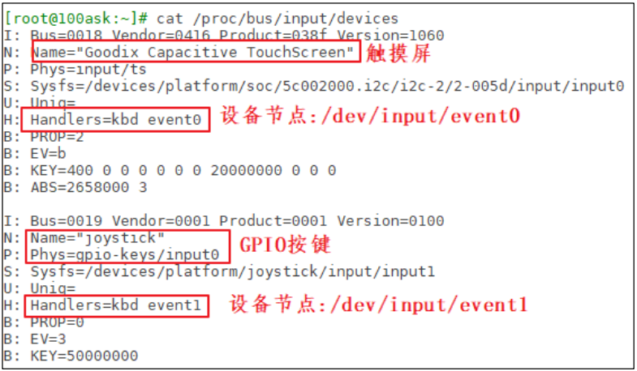
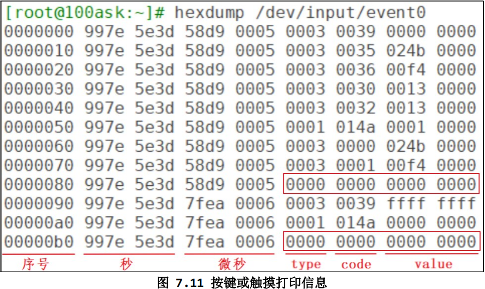

<!--
 * @Author: Clark
 * @Email: haixuanwoTxh@gmail.com
 * @Date: 2024-03-31 12:09:03
 * @LastEditors: Clark
 * @LastEditTime: 2024-09-15 10:32:59
 * @Description: file content
-->

# 1

hexdump /dev/input/event0

# 一、什么是输入系统
- 先来了解什么是输入设备？
常见的输入设备有键盘、鼠标、遥控杆、书写板、触摸屏等等,用户通过这些
输入设备与 Linux 系统进行数据交换。
 

- 什么是输入系统？
输入设备种类繁多，能否统一它们的接口？既在驱动层面统一，也在应用程
序层面统一？可以的。
 

    Linux 系统为了统一管理这些输入设备，实现了一套能兼容所有输入设备的
框架：输入系统。驱动开发人员基于这套框架开发出程序，应用开发人员就可以
使用统一的 API 去使用设备。

# 二、访问/dev/input/event0设备节点，或者使用tslib访问设备节点，数据的流程

- 1、APP发起读操作，若无数据则休眠

- 2、用户操作设备，硬件上产生中断

- 3、输入系统驱动层对应的驱动程序处理中断：
    读取到数据，转换为标准的输入事件，向核心层汇报。
    所谓输入事件就是一个“struct input_event”结构体。

- 4、核心层可以决定把输入事件转发给上面哪个 handler 来处理：
    从 handler 的名字来看，它就是用来处输入操作的。有多种 handler，比
    如：evdev_handler、kbd_handler、joydev_handler 等等。
    最常用的是 evdev_handler：它只是把 input_event 结构体保存在内核
    buffer 等，APP 来读取时就原原本本地返回。它支持多个 APP 同时访问输入设
    备，每个 APP 都可以获得同一份输入事件。
    当 APP 正在等待数据时，evdev_handler 会把它唤醒，这样 APP 就可以返
    回数据。

- 5、APP对输入事件的处理：
    APP获得数据的方法有2种：直接访问设备节点(比如/dev/input/event0,1,2,...)，或者通过tslib、libinput 这类库来间接访问设备节点。这些库简化了对数据的处理。

<pre>
struct input_dev
{
	const char *name;
	const char *phys;
	const char *uniq;
	struct input_id id;
	unsigned long propbit[BITS_TO_LONGS(INPUT_PROP_CNT)];

	unsigned long evbit[BITS_TO_LONGS(EV_CNT)];
	unsigned long keybit[BITS_TO_LONGS(KEY_CNT)];
	unsigned long relbit[BITS_TO_LONGS(REL_CNT)];
	unsigned long absbit[BITS_TO_LONGS(ABS_CNT)];
	unsigned long mscbit[BITS_TO_LONGS(MSC_CNT)];
	unsigned long ledbit[BITS_TO_LONGS(LED_CNT)];
	unsigned long sndbit[BITS_TO_LONGS(SND_CNT)];
	unsigned long ffbit[BITS_TO_LONGS(FF_CNT)];
	unsigned long swbit[BITS_TO_LONGS(SW_CNT)];

	unsigned int hint_events_per_packet;
	unsigned int keycodemax;
	unsigned int keycodesize;
	void *keycode;

	int (*setkeycode)(struct input_dev *dev, const struct input_keymap_entry *ke, unsigned int *old_keycode);
	int (*getkeycode)(struct input_dev *dev, struct input_keymap_entry *ke);

	struct ff_device *ff;
	unsigned int repeat_key;
	struct timer_list timer;

	int rep[REP_CNT];
	struct input_mt *mt;
	struct input_absinfo *absinfo;

	unsigned long key[BITS_TO_LONGS(KEY_CNT)];
	unsigned long led[BITS_TO_LONGS(LED_CNT)];
	unsigned long snd[BITS_TO_LONGS(SND_CNT)];
	unsigned long sw[BITS_TO_LONGS(SW_CNT)];

	int (*open)(struct input_dev *dev);
	void (*close)(struct input_dev *dev);
	int (*flush)(struct input_dev *dev, struct file *file);
	int (*event)(struct input_dev *dev, unsigned int type, unsigned int code, int value);

	struct input_handle __rcu *grab;

	spinlock_t event_lock;
	struct mutex mutex;

	unsigned int users;
	bool going_away;

	struct device dev;

	struct list_head	h_list;
	struct list_head	node;

	unsigned int num_vals;
	unsigned int max_vals;
	struct input_value *vals;

	bool devres_managed;
};
</pre>

- type：表示哪类事件
- code：表示该类事件下的哪一个事件
- value：表示事件值
- 事件之间的界线

input支持机制：阻塞、非阻塞、POLL/SELECT、异步通知

ls /dev/input/event*
ls /dev/input/
cat /proc/bus/input/devices

hexdump /dev/input/event0

查询方式
休眠-唤醒方式
POLL/SELECT 方式
异步通知方式：信号

电容屏
电阻屏

tslib

