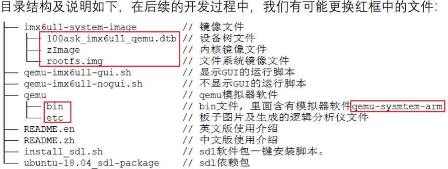
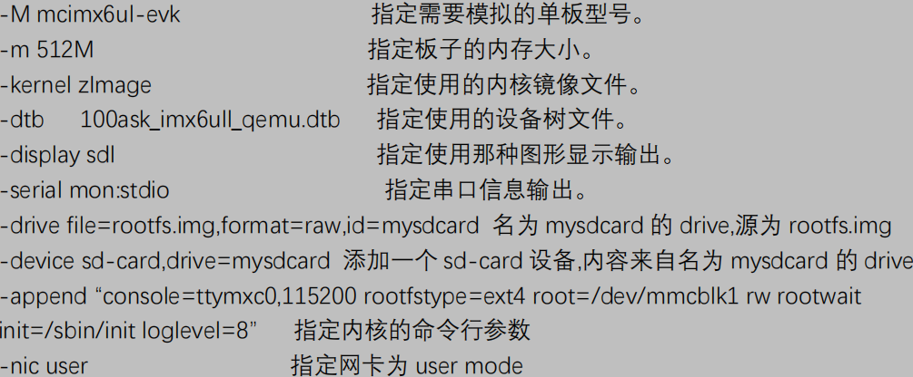
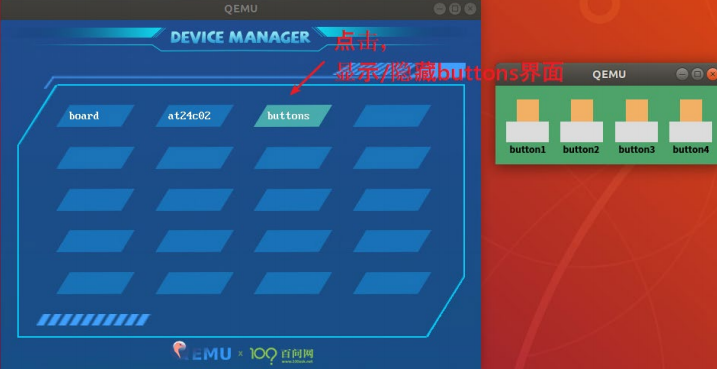
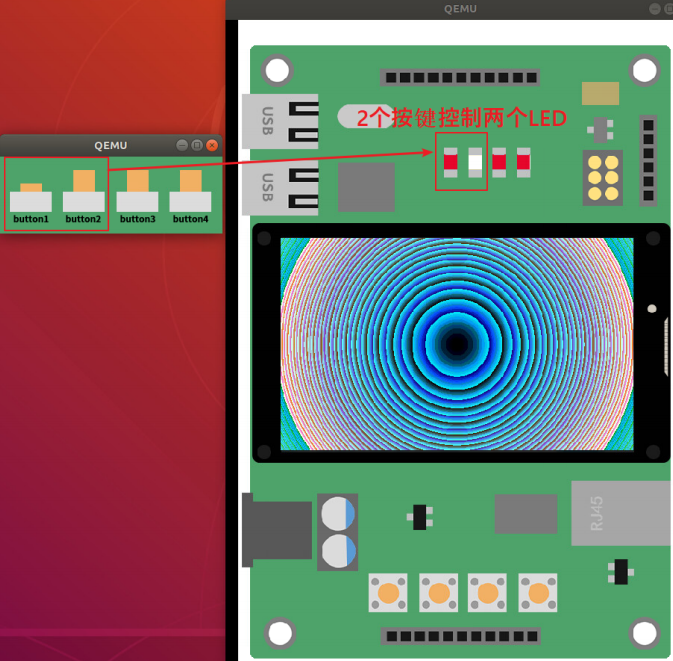
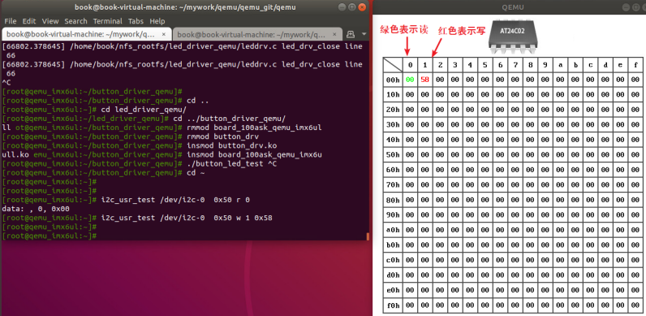

<!--
 * @Author: Clark
 * @Email: haixuanwoTxh@gmail.com
 * @Date: 2024-04-15 11:49:56
 * @LastEditors: Clark
 * @LastEditTime: 2024-04-15 15:47:33
 * @Description: file content
-->

./qemu-arm ./hello // 我们可以用 QEMU 在 PC 上运行它


# 安装 QEMU
sudo apt-get update
sudo apt-get install qemu qemu-kvm libvirt-bin bridge-utils virt-manager



```$ tar -xvf weidongshan-ubuntu-18.04_imx6ul_qemu_system-release.tgz ```
```$ ./install_sdl.sh ```
```$ ./qemu-imx6ull-gui.sh ```

如何退出qemu模拟器<br>
在终端下按住**Ctrl**和**A**键的同时按**C**
即进入 ```qemu monitor ```模式，
再输入 **q**命令即可退出QEMU

如何退出qemu的GUI窗口<br>
```Ctrl + Alt + G```






# 测试

## 1、fb
fb-test
myfb-test /dev/fb0

## 2、led
insmod 100ask_led.ko
./ledtest /dev/100ask_led0 off
./ledtest /dev/100ask_led0 on

## 3、按键控灯
insmod 100ask_led.ko
insmod button_drv.ko
insmod board_100ask_qemu_imx6ull.ko
 ./button_led_test


## 4、读写 I2C EEPROM AT24C02
在“QEMU 设备管理器”中打开 at24c02 的界面
i2c_usr_test /dev/i2c-0 0x50 r 0        // 读地址 0
i2c_usr_test /dev/i2c-0 0x50 w 1 0x58   // 写地址 1，写入 0x58



# 搭建开发环境

下载开发包

wget --no-check-certificate -O Configuring_ubuntu.sh https://weidongshan.coding.net/p/DevelopmentEnvConf/d/DevelopmentEnvConf/git/raw/master/Configuring_ubuntu.sh && sudo chmod +x Configuring_ubuntu.sh && sudo ./Configuring_ubuntu.sh

## 1、配置环境变量
vim ~/.bashrc
export ARCH=arm
export CROSS_COMPILE=arm-linux-gnueabihf-
export PATH=$PATH:/home/book/100ask_imx6ull-qemu/ToolChain/gcc-linaro-6.2.1-2016.11-x86_64_arm-linux-gnueabihf/bin

## 2、编译内核
make mrproper
make 100ask_imx6ull_qemu_defconfig
make zImage -j16
make dtbs

替换QEMU中ubuntu-18.04_imx6ul_qemu_system/imx6ull-system-image/下的zImage和100ask_imx6ull_qemu.dtb

## 3、修改根文件系统
sudo mount -o loop rootfs.img /mnt

修改完后
sudo umount /mnt
 ./qemu-imx6ull-gui.sh

## 4、网络
QEMU 运行时，Ubuntu 是 Host 即宿主机，QEMU 给它分配的 IP 是 10.0.2.2。
QEMU 模拟的 imx6ull 板子是 Guest 即客户机，它会自动获取 IP，也可以自己设置。
Guest 可以通过 10.0.2.2 访问 Host，Host 不能访问 Guest。

在QEMU中，可以通过 ifconfig 命令设置网卡的 IP 地址。
ifconfig eth0 10.0.2.15
mount -t nfs -o nolock,vers=3 10.0.2.2:/home/book/nfs_rootfs /mnt

